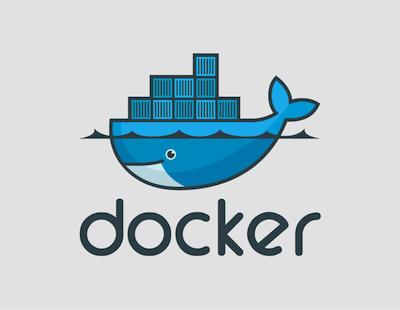

:date: 2013-07-05 10:48:29
:tags: docker, tutorial
:category: blog
:slug: the-ultimate-docker-tutorial
:author: Ken Cochrane
:title: the-ultimate-docker-tutorial

TODO:
Topics

- intro
- what is docker
- installation
    - requirements
        - kernel
        - LXC
        - aufs
    - server
    - developer setup
- docker daemon and config options
    - log file
    - config file
- commands
    - list all of them with explanation of all switches and examples on how to use each
- registry / index
    - index
        - create an account
            - web or command line
        - delete repo
        - change description
    - public
    - private
    - search
- remote api
    - libraries
    - web ui's
- build files
    - how to
    - examples
- using external mounts (not finished yet)
- creating images, pushing and pulling.
- docker run
    - limiting memory, cpu
    - detached vs attached
    - volume mounting

.. contents:: Table of Contents

Introduction
============
The goal of this tutorial is to introduce you to `Docker <http://docker.io>`_, show you what it can do, and how to get it up and running on your system, and how to use it to make your life better.

This guide is open source and available on `github.com <https://github.com/kencochrane/docker-tutorial>`_. If you would like to add to it or fix something, please `fork it <https://github.com/kencochrane/docker-tutorial>`_ and submit a pull request.

What is docker?
===============
Docker is a tool created by the folks at `dotCloud <http://dotcloud.com>`_ to make using LinuX Containers (`LXC <http://lxc.sourceforge.net/>`_) easier to use. Linux Containers are basically light weight Virtual Machines (`VM <http://en.wikipedia.org/wiki/Virtual_machine>`_). A linux container runs Unix processes with strong guarantees of isolation across servers. Your software runs repeatably everywhere because its Container includes all of its dependencies.

If you still don't understand what Docker is, and what it can do for you, don't worry, keep reading and it will become clear soon enough.

How is Docker's containers different from a normal Virtual Machine?
-------------------------------------------------------------------
Docker, which uses LinuX Containers (LXC) run in the same kernel as it's host. This allows it to share a lot of the host's resources. It also uses `AuFS <http://aufs.sourceforge.net>`_ for the file system. It also manages the networking for you as well.

AuFS is a layered file system, so you can have a read only part, and a write part, and it merges those together. So you could have the common parts of the file system as read only, which are shared amongst all of your containers, and then give each container it's own mount for writing.

So let's say you have a container image that is 1GB in size. If you wanted to use a Full VM, you would need to have 1GB times x number of VMs you want. With LXC and AuFS you can share the bulk of the 1GB and if you have 1000 containers you still might only have a little over 1GB of space for the containers OS, assuming they are all running the same OS image.

A full virtualized system gets it's own set of resources allocated to it, and does minimal sharing. You get more isolation, but it is much heavier (requires more resources).

With LXC you get less isolation, but they are more lightweight and require less resources. So you could easily run 1000's on a host, and it doesn't even blink. Try doing that with Xen, and unless you have a really big host, I don't think it is possible.

A full virtualized system usually takes minutes to start, LXC containers take seconds, and most times less then a second.

There are pros and cons for each type of virtualized system. If you want full isolation with guaranteed resources then a full VM is the way to go. If you just want to isolate processes from each other and want to run a ton of them on a reasonably sized host, then LXC might be the way to go.

For more information check out these set of blog posts which do a good job of explaining now LXC works: http://blog.dotcloud.com/under-the-hood-linux-kernels-on-dotcloud-part

Installing Docker
=================
Before you can install Docker you need to decide how you want to install it. There are three ways to install it, you can install from source, download a compiled binary, or install via your systems package manager. 

For detailed instructions on how to install Docker on your system for each of the following steps, check out the official Docker documentation http://docs.docker.io/en/latest/installation/

Requirements
------------
In order for Docker to run correctly on your server, you need to have a few things. For more details on the kernel requirements see this page: see http://docs.docker.io/en/latest/installation/kernel/

- Kernel version greater then 3.8 and Cgroups and namespaces must be enabled.
- AUFS : AUFS is included in the kernels built by the Debian and Ubuntu distributions, but not built into the standard kernel, so if you are using another distribution you will need to add it to your kernel.
- LXC : This is most likely already installed on your system and kernel, you might just need to install a system package or two. See the install instructions for your distribution to get a list of packages.

Kernel version
~~~~~~~~~~~~~~
The reason why Docker needs to run in a kernel version of 3.8 or greater is because there are some kernel bugs that are in the older versions that cause problems in some cases. Some people have ran Docker fine on lower kernels, so if you can't run on 3.8, do so at your own risk. There is talk about an effort to back port the bug fixes to the older kernel trees, so that in the future they will be available on the older kernel versions. For more information about this see. https://github.com/dotcloud/docker/pull/1062

AUFS
~~~~
Currently AUFS is the standard file system for Docker, but there is an effort underway to make the filesystem more pluggable, so that we can use different file systems with Docker. AUFS will most likely not be available in future Ubuntu releases, and UnionFS doesn't look like it will be getting added to the kernel anytime soon, so we can't add that as a replacement. The current replacement looks like `BTRFS <https://github.com/dotcloud/docker/issues/443>`_.

Package Manager
---------------
The most common way to install Docker is via your server's package manager. On Ubuntu that is as simple as running the following command ``sudo apt-get install lxc-docker``. This is an easy way to install docker, and keep it up to date. 

The package will also install an init script so that the docker daemon will start up automatically.

If you are installing on a production server, this is the recommended way to install. 

Upgrading:
~~~~~~~~~~
To upgrade you would upgrade the same way you upgrade any other package for your system. On Ubuntu you would run 'sudo apt-get upgrade'

Binaries
--------
If a docker package isn't available for your package manager, you can download the binaries directly. When a new version of docker is released the binaries are uploaded to http://get.docker.io, so that you can download directly from there. Here is an example on how to download the latest docker release.

::

    wget http://get.docker.io/builds/Linux/x86_64/docker-latest.tgz
    tar -xf docker-latest.tgz

This just downloads the docker binary, to get it to run you would still need to put the binary in a good location, and create an init script so that it will start on system reboots.

Init script examples:
~~~~~~~~~~~~~~~~~~~~~

- Debian init: https://github.com/dotcloud/docker/blob/master/packaging/debian/lxc-docker.init
- Ubuntu Upstart: https://github.com/dotcloud/docker/blob/master/packaging/ubuntu/docker.upstart

Upgrading:
~~~~~~~~~~
To upgrade you would need to download the latest version, make a backup of the current docker binary, replace the current one with the new one, and restart your daemon. The init script should be able to stay the same.

More information:
~~~~~~~~~~~~~~~~~
http://docs.docker.io/en/latest/installation/binaries/

From Source
-----------
Installing from a package manager or from a binary is fine if you want to only install released versions. But if you want to be on the cutting edge and install some features that are either on a feature branch, or something that isn't released yet, you will need to compile from source.

Compiling from source is a little more complicated because you will need to have GO 1.1 and all other dependences install on your system, but it isn't too bad. 

Here is what you need to do to get it up and running on Ubuntu::

    sudo apt-get install python-software-properties
    sudo add-apt-repository ppa:gophers/go
    sudo apt-get update
    sudo apt-get -y install lxc xz-utils curl golang-stable git aufs-tools

    export GOPATH=~/go/
    export PATH=$GOPATH/bin:$PATH

    mkdir -p $GOPATH/src/github.com/dotcloud
    cd $GOPATH/src/github.com/dotcloud
    git clone git://github.com/dotcloud/docker.git
    cd docker

    go get -v github.com/dotcloud/docker/...
    go install -v github.com/dotcloud/docker/...

Then run the docker daemon::

    sudo $GOPATH/bin/docker -d

If you make any changes to the code, run the ``go install`` command (above) to recompile docker. Feel free to change the git clone command above to your own fork, to make pull request's easier.

Docker requires Go 1.1, if you have an older version it will not compile correctly.

Docker Daemon
=============
The Docker daemon needs to be running on your system to control the containers. The daemon needs to be run as Root so that it can have access to everything it needs.

Starting the daemon
-------------------
There are two ways to start the daemon, you can start it using an init script so that it starts on system boot, and manually starting the daemon and sending to the background. The init script is the preferred way of doing this. If you install Docker via a package manager you already have the init script on your system.

To start it manually you need to use a command like this.

::

    sudo <path to>/docker -d &

When Docker starts, it will listen on 127.0.0.1:4243 to allow only local connections but you can set it to 0.0.0.0:4243 or a specific host ip to give access to everybody. 

To change the host and port that docker listens to you will need to use the ``-H`` flag when starting docker.

``-H`` accepts host and port assignment in the following format: tcp://[host][:port] or unix://path For example:

- tcp://host -> tcp connection on host:4243
- tcp://host:port -> tcp connection on host:port
- tcp://:port -> tcp connection on 127.0.0.1:port
- unix://path/to/socket -> unix socket located at path/to/socket

When you do this, you need to also let the docker client know what daemon you want to connect too. To do that you have to also pass in the -H flag to with the ip:port of the daemon to connect too.

::

    # Run docker in daemon mode on port 5555
    sudo <path to>/docker -H 0.0.0.0:5555 &
    
    # Download a base image using the daemon on port 5555
    docker -H :5555 pull base

You can use multiple -H, for example, if you want to listen on both tcp and a unix socket

::

    # Run docker in daemon mode on 127.0.0.1:4243 and unix socket unix:///var/run/docker.sock
    sudo <path to>/docker -H tcp://127.0.0.1:4243 -H unix:///var/run/docker.sock
    
    # Download a base image (no need to put the -H since it is listen on default port :4243)
    docker pull base
    
    # OR (pull via the unix socket)
    docker -H unix:///var/run/docker.sock pull base

Configuration
-------------
Currently if you want to configure the docker daemon, you can either pass in command switches to the docker daemon on startup, or you can set ENV variables that the docker daemon will pick up. I have proposed a better approach for configuring docker, the idea is to use a ``docker.conf`` file so that it is easier to set and is more obvious. Details can be found here: https://github.com/dotcloud/docker/issues/937

There are two ENV variables that you can set today, there maybe more added in the future.

DEBUG
~~~~~
This tells the Docker daemon that you want more debug information in your logs. 

defaults to DEBUG=0, set to DEBUG=1 to enable.

DOCKER_INDEX_URL
~~~~~~~~~~~~~~~~
This tells Docker which Docker index to use. You will most likely not use this setting, it is mostly used for Docker developer when they want to try things out with the test index before they release the code. 

defaults to DOCKER_INDEX_URL=https://index.docker.io

Logs
----
There is no official Docker log file right now, I have opened an issue and requested one: https://github.com/dotcloud/docker/issues/936 but in the meantime if you are using upstart you can use ``/var/log/upstart/docker.log`` which has some information, but not as much as I would like.

Testing Docker install
======================
Now that you have Docker running, you can start to issue some Docker commands to see how things are working. The very first commands that I always run are ``Docker version`` and ``Docker info``. These tell me quickly if I have everything working correctly. 

::

    $ docker version
    Client version: 0.4.8
    Server version: 0.4.8
    Go version: go1.1

    $ docker info
    Containers: 0
    Images: 0
    WARNING: No memory limit support
    WARNING: No swap limit support

Notice that I have two warnings for my docker info. If you use Debian or Ubuntu kernels, and want to enable memory and swap accounting, you must add the following command-line parameters to your kernel:

    cgroup_enable=memory swapaccount=1

On Debian or Ubuntu systems, if you use the default GRUB bootloader, you can add those parameters by editing ``/etc/default/grub`` and extending GRUB_CMDLINE_LINUX. Look for the following line:

    GRUB_CMDLINE_LINUX=""

And replace it by the following one:

    GRUB_CMDLINE_LINUX="cgroup_enable=memory swapaccount=1"

Then run ``update-grub``, and reboot the server.

Docker Commands
===============
Here is a list of all of the current Docker commands, the different parameters they might have, as well as an example or two on how to use them.

attach
------
Attach to a running container.

Parameters
~~~~~~~~~~
- container_id: The ID for the container you want to attach too.

Usage
~~~~~
::

    docker attach <container_id>

Example
~~~~~~~
::

    docker attach afs232ybh2123d

build
-----
Build a container from a Dockerfile

Parameters
~~~~~~~~~~
- PATH: Build a new container image from the source code at PATH
- URL: When a single Dockerfile is given as URL, then no context is set. When a git repository is set as URL, the repository is used as context
- OPTIONS:
    - -t="" : Tag to be applied to the resulting image in case of success.

Usage
~~~~~
::

    docker build [OPTIONS] PATH | URL | -

Examples
~~~~~~~~

Read the Dockerfile from the current directory
^^^^^^^^^^^^^^^^^^^^^^^^^^^^^^^^^^^^^^^^^^^^^^
::

    docker build .

This will read the Dockerfile from the current directory. It will also send any other files and directories found in the current directory to the docker daemon. The contents of this directory would be used by ADD commands found within the Dockerfile.
This will send a lot of data to the docker daemon if the current directory contains a lot of data.
If the absolute path is provided instead of ‘.’, only the files and directories required by the ADD commands from the Dockerfile will be added to the context and transferred to the docker daemon.

Read a Dockerfile from standard in (stdin) without context
^^^^^^^^^^^^^^^^^^^^^^^^^^^^^^^^^^^^^^^^^^^^^^^^^^^^^^^^^^
::
    docker build - < Dockerfile
    
This will read a Dockerfile from Stdin without context. Due to the lack of a context, no contents of any local directory will be sent to the docker daemon. ADD doesn’t work when running in this mode due to the absence of the context, thus having no source files to copy to the container.

Build from a git repo
^^^^^^^^^^^^^^^^^^^^^^
::

    docker build github.com/creack/docker-firefox

This will clone the github repository and use it as context. The Dockerfile at the root of the repository is used as Dockerfile.
Note that you can specify an arbitrary git repository by using the ‘git://’ schema.

commit
------
Save your containers state to a container image, so the state can be re-used.

When you commit your container only the differences between the image the container was created from and the current state of the container will be stored (as a diff). See which images you already have using docker images

In order to commit to the repository it is required to have committed your container to an image with your namespace.

Parameters
~~~~~~~~~~
- CONTAINER_ID: The container ID for the container you want to commit
- REPOSITORY: The name for your image that you will save to the repository <your username>/<image name>
- TAG: The tag you want to give to the commit.
- OPTIONS:
    - -m="": Commit message
    - -author="": Author (eg. "John Hannibal Smith <hannibal@a-team.com>"
    - -run="": Config automatically applied when the image is run. "+`(ex: {"Cmd": ["cat", "/world"], "PortSpecs": ["22"]}')

Usage
~~~~~
::

    docker commit [OPTIONS] CONTAINER_ID [REPOSITORY [TAG]]

Examples
~~~~~~~~

basic commit
^^^^^^^^^^^^
This will commit a container with a message and author.
::

    docker commit -m="My commit message" -author="Joe smith" a1bcbabsdhb323h2b

commit with repository
^^^^^^^^^^^^^^^^^^^^^^
Same as basic commit, but with a repository name
::

    docker commit -m="My commit message" -author="Joe smith" a1bcbabsdhb323h2b joesmith/myrepo

commit with tag
^^^^^^^^^^^^^^^
Same as basic commit, but with a repository name and tag
::

    docker commit -m="My commit message" -author="Joe smith" a1bcbabsdhb323h2b joesmith/myrepo mytag

Full example
^^^^^^^^^^^^
An example with all parameters and options.
::

    docker commit -m="My commit message" -author="Joe smith" -run='{"Hostname": "", "User": "","CpuShares": 0,"Memory": 0,"MemorySwap": 0,"PortSpecs": ["22", "80", "443"],"Tty": true,"OpenStdin": true,"StdinOnce": true,"Env": ["FOO=BAR", "FOO2=BAR2"],"Cmd": ["cat", "-e", "/etc/resolv.conf"],"Dns": ["8.8.8.8", "8.8.4.4"]}' a1bcbabsdhb323h2b joesmith/myrepo mytag

